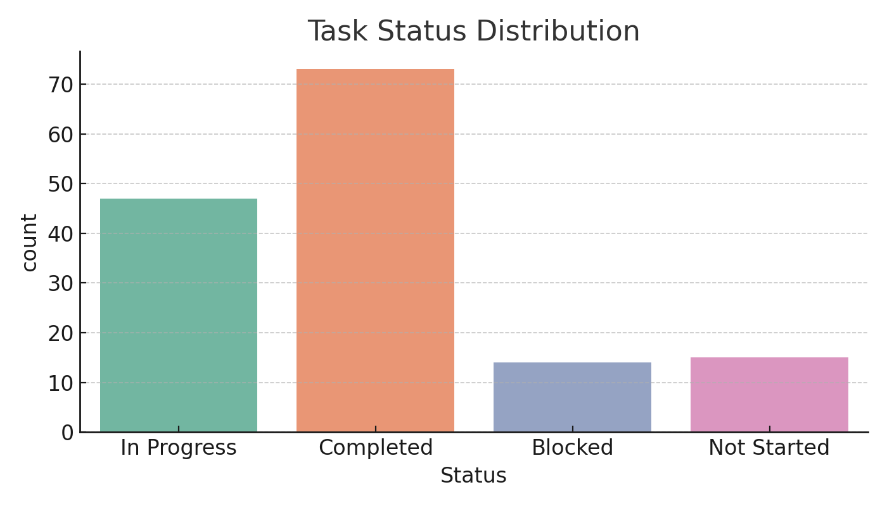
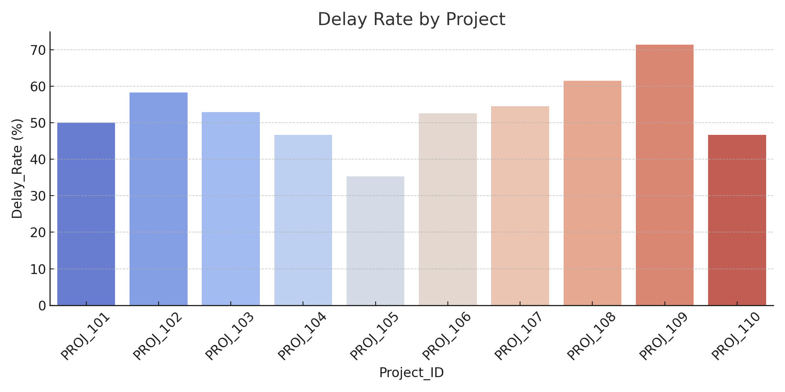
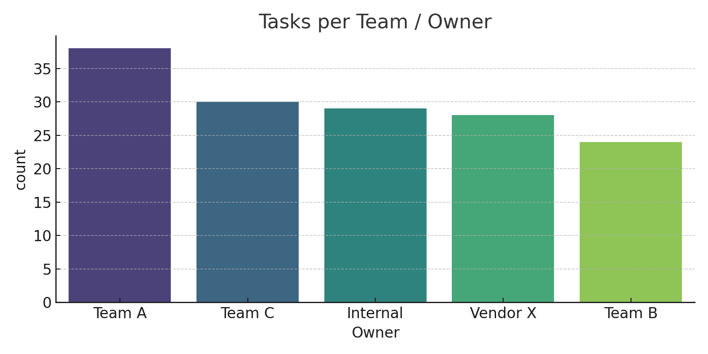
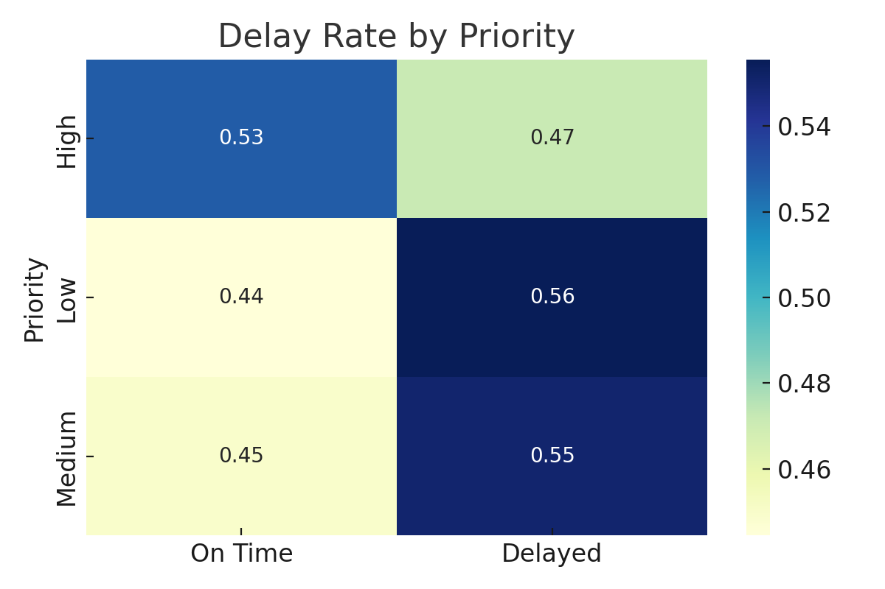

# Project Milestone Health Dashboard

A project tracking and milestone risk analysis dashboard built in Python. This project simulates multi-project task management data to monitor delays, track status, assess team workload, and visualize delay risk by priority level.

---

## Repository Name

**project-milestone-health-dashboard**

---

## Objective

- Analyze and visualize the health of active projects using task-level tracking
- Identify delay rates by project, owner, and priority
- Detect bottlenecks and high-risk task patterns
- Deliver stakeholder-ready dashboards using Seaborn + Matplotlib

---

## Tools & Technologies

- Python (Pandas, Matplotlib, Seaborn)
- Jupyter Notebook
- Simulated project task data

---

## Key Features

- Task status breakdown across 10+ simulated projects
- Delay rate visualization per project
- Team-level task load distribution
- Heatmap of delays based on task priority
- Visual outputs for dashboards and stakeholder reporting

---

## Files Included

- `Project Milestone Health Dashboard.ipynb` – Full Python analysis
- `project_milestone_health.csv` – Simulated dataset with 100+ tasks
- PNGs:
  - `task_status.png`
  - `delay_by_project.png`
  - `team_workload.png`
  - `delay_priority.png`

---

## Sample Visuals

### 1. Task Status Overview

### 2. Delay Rate by Project

### 3. Team Workload

### 4. Delay vs Priority Heatmap

---

## Dataset Source

This dataset was **synthetically generated** for educational and portfolio purposes.  
It simulates task timelines, delays, ownership, priorities, and dependencies across multiple projects.

---

